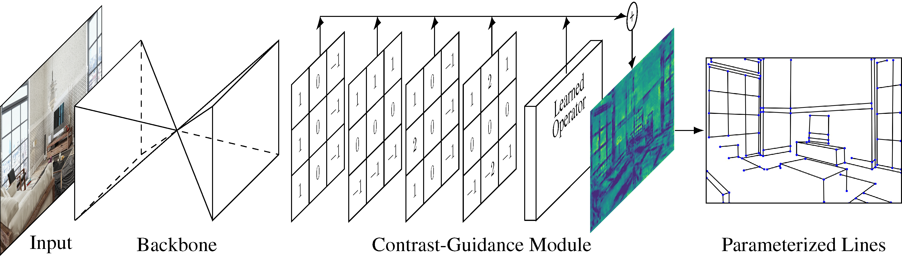

# CGWP

Official implementation of Contrast-Guided Wireframe Parser (CGWP)

## Model Structure

## Quantitative Results

**ShanghaiTech Dataset**

| Method      |   sAP^5  |  sAP^10  |  sAP^15  |   AP^H   |    F^H   |
|-------------|:--------:|:--------:|:--------:|:--------:|:--------:|
| LSD         |    8.2   |   10.6   |   12.1   |   52.0   |   61.0   |
| DeepLSD     |    8.4   |   10.5   |   11.7   |   48.3   |   58.9   |
| DWP         |    3.7   |    5.1   |    5.9   |   67.8   |   72.6   |
| AFM         |   18.5   |   24.4   |   27.5   |   69.2   |   77.2   |
| L-CNN       |   58.9   |   62.9   |   64.6   |   82.8   |   81.2   |
| HAWP        |   62.5   |   66.5   |   68.2   |   84.5   |   80.3   |
| TP-LSD      |   50.9   |   57.1   |   59.5   |   80.1   |   62.6   |
| LETR        |   59.2   |   65.2   |   67.7   |   85.5   |   79.8   |
| ELSD        |   62.7   |   67.2   |   69.0   |   84.7   |   80.3   |
| F-Clip      |   61.9   |   66.6   |   68.7   |   84.0   |   79.6   |
| CGWP (Ours) | **64.5** | **68.6** | **70.4** | **85.7** | **81.5** |

**YorkUrban Dataset**

| Method      |   sAP^5  |  sAP^10  |  sAP^15  |   AP^H   |    F^H   |
|-------------|:--------:|:--------:|:--------:|:--------:|:--------:|
| LSD         |    8.7   |   10.3   |   11.6   |   51.0   |   60.0   |
| DeepLSD     |    8.5   |    9.8   |   10.8   |   51.2   |   60.4   |
| DWP         |    1.5   |    2.1   |    2.6   |   53.4   |   63.7   |
| AFM         |    7.3   |    9.4   |   11.1   |   48.2   |   63.3   |
| L-CNN       |   24.4   |   26.4   |   27.5   |   59.8   |   65.4   |
| HAWP        |   26.2   |   28.5   |   29.6   |   60.6   |   64.8   |
| TP-LSD      |   19.3   |   22.2   |   24.0   |   59.0   |   62.4   |
| LETR        |   23.9   |   27.6   |   29.7   |   59.6   |   62.0   |
| ELSD        |   23.9   |   26.3   |   27.9   |   57.8   |   62.1   |
| F-Clip      |   27.5   | **29.8** | **31.3** |   62.0   |   67.3   |
| CGWP (Ours) | **27.6** |   29.7   | **31.3** | **62.9** | **68.3** |

## Training Details

We utilized almost the same training strastrategy as L-CNN, HAWP, and F-Clip. This includes using the Adam optimizer, a learning rate of 4e-4, and a weight decay of 1e-4. Our training lasted for 120 epochs, each with 5000 images. After the first 100 epochs, we lowered the learning rate to 10%. We followed the same steps for image enhancement as these models. The total loss is the weighted sum of the component losses.

Our code will be released soon!
